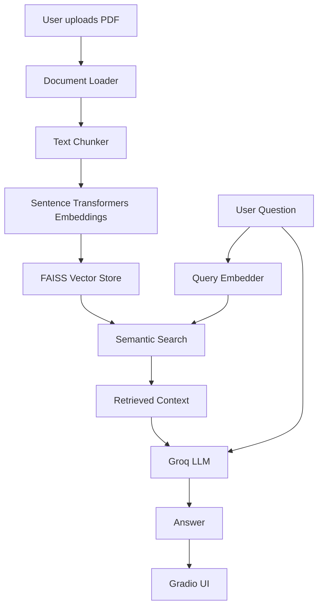

## 🔗 Live Demo

Try it live: https://huggingface.co/spaces/Digvijay8809/rag-qa-system
# RAG Q&A System

A production-ready Retrieval-Augmented Generation (RAG) pipeline 
that lets you upload any PDF and ask questions about it using LLMs.

## Tech Stack
- **LangChain** — RAG orchestration
- **FAISS** — Vector database for semantic search
- **Hugging Face** — Sentence embeddings (all-MiniLM-L6-v2)
- **Groq LLM** — Fast LLM inference (llama-3.3-70b-versatile)
- **FastAPI** — REST API serving
- **Docker** — Containerization

## Features
- Upload any PDF via REST API
- Automatic text chunking and embedding
- Semantic search using FAISS vector store
- Context-aware answers using LLM
- Interactive API docs via Swagger UI

## Setup
1. Clone the repo
2. Create virtual environment: `python -m venv venv`
3. Install dependencies: `pip install -r requirements.txt`
4. Add your Groq API key to `.env`: `GROQ_API_KEY=your_key`
5. Run: `uvicorn main:app --reload`
6. Visit: `http://127.0.0.1:8000/docs`

## API Endpoints
- `POST /upload-pdf` — Upload a PDF
- `POST /ask` — Ask a question about the uploaded PDF
- `GET /health` — Health check

## How to Run Locally

1. Clone the repo
   git clone https://github.com/digvijay2004/rag-qa-system.git
   cd rag-qa-system

2. Create virtual environment
   python -m venv venv
   venv\Scripts\activate

3. Install dependencies
   pip install -r requirements.txt

4. Add your Groq API key to .env
   GROQ_API_KEY=your_key_here

5. Run the app
   python app.py

6. Visit http://127.0.0.1:7860